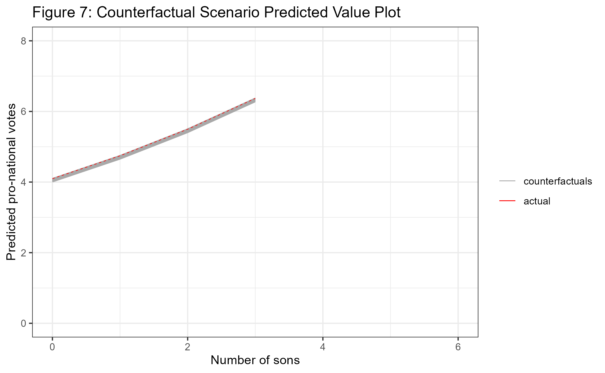

```{r setup, include=FALSE}
knitr::opts_chunk$set(echo = FALSE, warning=FALSE, message=FALSE)
library(haven)
library(ggplot2)
library(tidyverse)
library(sandwich)
library(grid)
library(gridExtra)
library(corrplot)
library(Amelia)
library(ggeffects)
library(modelsummary)
library(AER)
library(sampleSelection)
library(stargazer)
library(kableExtra)
library(vcd)
library(MASS)
library(COUNT)
library(boot)
library(Amelia)
library(reshape2)
```

```{r, message=FALSE}
# Get the replication dataset
dataset <- read_dta("Original Dataset/founding fathers dataset-corrections-attendance-replication.dta")

# Get the ICPSR delegate vote dataset
ICPSR_data <- read_delim("ICPSR Dataset/ICPSR24544-Data.tsv", 
                         "\t", escape_double = FALSE, trim_ws = TRUE) %>% 
              dplyr::select(firstname, lastname, state, state_num,
                            dv30, dv230, dv268, dv336, dv345,
                            dv387, dv399, dv415)

# Recode missing data
ICPSR_data[,5:12] <- na_if(ICPSR_data[,5:12], 9)
ICPSR_data[,5:12] <- na_if(ICPSR_data[,5:12], 0)
ICPSR_data[,5:12][ICPSR_data[,5:12]==6] <- 0

# Recode anti votes
ICPSR_data[,c(6,7,8,11)][ICPSR_data[,c(6,7,8,11)]==1] <- 0
ICPSR_data[,c(6,7,8,11)][ICPSR_data[,c(6,7,8,11)]==6] <- 1

# Recode vote votes
ICPSR_data[,c(5,9,10,12)][ICPSR_data[,c(5,9,10,12)]==6] <- 0

colnames(ICPSR_data) <- c("firstname", "lastname", "state", "statenum", "vote2",
                          "anti5", "anti6", "anti7", "vote8","vote9", "anti14",
                          "vote15")
```

## Introduction

This article is a replication of Jeremy C. Pope and Soren J. Schmidt's 2021 piece "Father Founders: Did Child Gender Affect Voting at the Constitutional Convention?". In it, they test the hypothesis that the delegates with sons would tend to vote for a stronger national government because they foresaw such a government providing greater opportunities for their sons--for which they find evidence. I begin by replicating their primary model, a Poisson regression on a vote index, and their probit models of individual votes. I then examine the distributions of underlying data to ensure their models are appropriate. I then use the dataset from which their paper's dataset was derived to assess missingness and imputation in the authors' work. Finally, I assess the differences in standard errors for their model covariates comparing their `STATA` robust standard errors with `R`'s `glm()` standard errors and boostrapped standard errors.
**MAYBE SCRAP**

## Data

The replication data used is provided by Pope and Schmidt (2021). I also employ Dougherty and Heckelman's (2009) dataset which provides delegate vote data without the imputation done in Pope and Schmidt's replication data. All code for this project is available at https://github.com/zaynesember/PopeSchmidtReplication.

\begin{center}
\textbf{Figure 1: Correlation Matrix of Variables}
\end{center}

```{r, out.width=1000, fig.show="hold"}
n <- dataset %>% dplyr::select(index1, vote2, anti5, anti6, anti7, vote8, vote9, anti14, vote15, sons, dtrs, ageco, agecosq, revoffco,
                     nslave, dist2, vsecr, vbank, ddebt, pols, lawyer)
m <- cor(n)

corrplot(m, method="color", addCoef.col = "black",
         tl.col="gray16", tl.srt=45, number.cex=0.4,
         title="")
```

## Results

### Model Replication

Pope and Schmidt (2021) present 9 models of interest here, all of which share the same covariates (with the exception of what the authors call multicollinearity but is better termed perfect separation). Their primary model is a Poisson regression on a "preferred index" of the eight votes evaluated in each of the additional probit models. The preferred index is calculated by summing the number of "yea" votes for expanding the national government and "nay" votes on limiting the government. Appendix A provides the table of all independent and dependent variables. Dependent variables labeled "vote" indicate a vote where a "yea" expands the government and those labeled "anti" denote a vote limiting government. A correlation matrix of all variables is shown in Figure 1. Many of the individual votes (`vote2` through `vote15`) are correlated with one another but this does not threaten any assumptions of the models. Of the independent variables, none are unexpectedly strongly correlated with each other or with the dependent variables.

Table 1 presents the replication of these eight models. All coefficients agree with those presented by Pope and Schmidt, although some standard errors on the probit models differ very slightly. This is due to the original analysis being done in `STATA` with the `robust` command; the similar robust errors reported here were calculated in `R` using the `sandwich` library's `vcovCL` function. The National Exports and State Credit models omit three and twelve observations, respectively. These are omitted to replicate the manner in which `STATA` handles probit models with perfect separation. The debtor and private securities coefficients are omitted from these models due to perfect multicollinearity after the observations are dropped.

```{r}
model_poisson_R <- glm(index1 ~ sons + dtrs + ageco + agecosq + revoffco
                     + nslave + dist2 + vsecr + vbank + ddebt + pols + lawyer,
                     data=dataset, family = poisson(link = "log"))

# Generate predicted values for significant coefficients
# Note that ggpredict back-transforms the logged dependent variable! 
pred1 <- ggpredict(model_poisson_R, c("sons"))


# Plot the predicted values
pred_sons <- ggplot(pred1, aes(x=x,y=predicted)) +
  geom_line() +
  geom_ribbon(aes(ymin = conf.low, ymax = conf.high), alpha = .25) +
  xlab("Number of sons") +
  ylab("Predicted pro-national votes") +
  ylim(c(0,10)) +
  xlim(c(0,3)) +
  theme_bw()

pred2 <- ggpredict(model_poisson_R, c("dist2"))


# Plot the predicted values
pred_dist <- ggplot(pred2, aes(x=x,y=predicted)) +
  geom_line() +
  geom_ribbon(aes(ymin = conf.low, ymax = conf.high), alpha = .25) +
  xlab("Distance from coastline") +
  ylab("Predicted pro-national votes") +
  ylim(c(0,10)) +
  theme_bw()


pred3 <- ggpredict(model_poisson_R, c("nslave"))


# Plot the predicted values
pred_nslave <- ggplot(pred3, aes(x=x,y=predicted)) +
  geom_line() +
  geom_ribbon(aes(ymin = conf.low, ymax = conf.high), alpha = .25) +
  xlab("Number of slaves") +
  ylab("Predicted pro-national votes") +
  ylim(c(0,10)) +
  theme_bw()

grid.arrange(pred_sons, pred_dist, pred_nslave, nrow=1, top="Figure 2: Predicted Value Plots")
```

Figure 2 replicates Pope and Schmidt's (2020) Figure 2, providing predicted value plots for the variable of interest (number of sons) and two other influential variables. As they conclude, there is clear evidence that delegates with more sons tended to vote more in favor of expanding the national government at a magnitude comparable to other pertinent variables such as distance from a navigable coastline and number of slaves owned. 

```{r, warning=FALSE}
# Code taken from:
# https://stats.stackexchange.com/questions/89999/
# how-to-replicate-statas-robust-binomial-glm-for-proportion-data-in-r
# Creates robust standard errors for glm models
# NO LONGER NEEDED/USED
robustify <- function(model){
  cov.m1 <- vcovHC(model, type = "HC0")
  
  std.err <- sqrt(diag(cov.m1))
  
  q.val <- qnorm(0.975)
  
  retVal <- cbind(
    Estimate = coef(model)
    , "Robust SE" = std.err
    , z = (coef(model)/std.err)
    , "Pr(>|z|) "= 2 * pnorm(abs(coef(model)/std.err), 
                             lower.tail = FALSE)
    , LL = coef(model) - q.val  * std.err
    , UL = coef(model) + q.val  * std.err
  )
  return(retVal)
}

# Because R and STATA don't get along, this function takes a 
# sampleSelection::probit model with robust SEs and formats the output to be
# presented in a neat table since stargazer and modelsummary don't support
# the model output by sampleSelection
# NO LONGER NEEDED/USED
fmt_col <- function(model, DV){
  ests <- rep(NA, nrow(model))
  errs <- rep(NA, nrow(model))
  
  for(i in 1:nrow(model)){
    sig <- ""
    if(model$p[i] < 0.01){sig <- '***'}
    else if(model$p[i] < 0.05){sig <- '**'}
    else if(model$p[i] < 0.1){sig <- '*'}
    
    ests[i] <- paste(model$estimate[i],sig, sep="")
    errs[i] <- paste("(",model$stderr[i],")",sep="")
  }
  return(c(rbind(ests,errs),toString(length(DV))))
}

# Replicate each model
model_poisson_R <- glm(index1 ~ sons + dtrs + ageco + agecosq + revoffco
                     + nslave + dist2 + vsecr + vbank + ddebt + pols + lawyer,
                     data=dataset, family = poisson(link = "log"))

model_probit1_R <- glm(vote2 ~ sons + dtrs + ageco + agecosq +
                    revoffco + nslave + dist2 + vsecr + vbank +
                    ddebt + pols + lawyer,
                    data=dataset, family=binomial(link="probit"))

model_probit2_R <- glm(anti5 ~ sons + dtrs + ageco + agecosq +
                    revoffco + nslave + dist2 + vsecr + vbank +
                    ddebt + pols + lawyer,
                    data=dataset, family=binomial(link="probit"))

model_probit3_R <- glm(anti6 ~ sons + dtrs + ageco + agecosq +
                    revoffco + nslave + dist2 + vsecr + vbank +
                    ddebt + pols + lawyer,
                    data=dataset, family=binomial(link="probit"))

# Remove observations dropped by STATA
temp <- dataset[-c(3,12,19),]
model_probit4_R <- glm(anti7 ~ sons + dtrs + ageco + agecosq +
                    revoffco + nslave + dist2 + vsecr + vbank +
                    ddebt + pols + lawyer,
                    data=temp, family=binomial(link="probit"))

model_probit5_R <- glm(vote8 ~ sons + dtrs + ageco + agecosq +
                    revoffco + nslave + dist2 + vsecr + vbank +
                    ddebt + pols + lawyer,
                    data=dataset, family=binomial(link="probit"))

# Remove observations dropped by STATA
temp <- dataset[-c(9,15,28,33,36,37,40:43,50,51),]
model_probit6_R <- glm(vote9 ~ sons + dtrs + ageco + agecosq +
                    revoffco + nslave + dist2 + vsecr + vbank +
                    ddebt + pols + lawyer,
                    data=temp, family=binomial(link="probit"))

model_probit7_R <- glm(anti14 ~ sons + dtrs + ageco + agecosq +
                    revoffco + nslave + dist2 + vsecr + vbank +
                    ddebt + pols + lawyer,
                    data=dataset, family=binomial(link="probit"))

model_probit8_R <- glm(vote15 ~ sons + dtrs + ageco + agecosq +
                    revoffco + nslave + dist2 + vsecr + vbank +
                    ddebt + pols + lawyer,
                    data=dataset, family=binomial(link="probit"))

# Store models and their standard errors, output into a table
model_list <- list('Preferred Index' = model_poisson_R, 
                   'National Veto'=model_probit1_R, 
                   'Debtor Legislators'=model_probit2_R,
                   'Cong. Quorum'=model_probit3_R, 
                   'National Exports'=model_probit4_R, 
                   'Militia Control'=model_probit5_R,
                   'State Credit'=model_probit6_R, 
                   'Navigation Acts'=model_probit7_R, 
                   'Military Responsibility'=model_probit8_R)

SE_list <- list(coeftest(model_list[[1]], vcovCL)[,2],
                coeftest(model_list[[2]], vcovCL)[,2],
                coeftest(model_list[[3]], vcovCL)[,2],
                coeftest(model_list[[4]], vcovCL)[,2],
                coeftest(model_list[[5]], vcovCL)[,2],
                coeftest(model_list[[6]], vcovCL)[,2],
                coeftest(model_list[[7]], vcovCL)[,2],
                coeftest(model_list[[8]], vcovCL)[,2],
                coeftest(model_list[[9]], vcovCL)[,2]
                )

cnames <- c("Preferred Index","National Veto","Debtor Legislators",
            "Cong. Quorum.","National Exports","Militia Control",
            "State Credit","Navigation Acts","Military Responsibility")

rnames <- c('(Intercept)'="Constant",
            'sons'="Number of sons",
            'dtrs'="Number of daughters",
            'ageco'="Age",
            'agecosq'="Age squared",
            'revoffco'="Revolutionary war officer",
            'nslave'="Logged number of slaves",
            'dist2'="Distance to navigable coastline",
            'vsecr'="Public securities (1000s, 1787 dollars)",
            'vbank'="Private securities (1000s, 1787 dollars)",
            'ddebt'="Debtor (dummy)",
            'pols'="Politician",
            'lawyer'="Lawyer")


table2 <- modelsummary(model_list, statistic_override=SE_list, stars=T,
                       coef_rename=rnames,
                       notes=c("NA coefficients omitted due to perfect
                               multicollinearity.",
                               "Preferred index model is a Poisson regression,
                               all others are probit.
                               Standard errors are robust."),
                       title="Model Replications",
                       output="kableExtra")

table2 %>% kable_styling(latex_options="scale_down") %>% landscape

```

```{r, message=FALSE, warning=FALSE, eval=FALSE}
# Get the individual vote distributions
vote1 <- ggplot(aes(x=vote2),data=dataset) +
  geom_histogram(binwidth = 0.5, col="darkgray", fill="coral4") +
  xlab("National Veto Vote") +
  ylab("") +
  scale_x_continuous(breaks = c(0,1)) +
  theme_bw()

vote2 <- ggplot(aes(x=anti5),data=dataset) +
  geom_histogram(binwidth = 0.5, col="darkgray", fill="chocolate2") +
  xlab("Debtor Legislators Vote") +
  ylab("") +
  scale_x_continuous(breaks = c(0,1)) +
  theme_bw()

vote3 <- ggplot(aes(x=anti6),data=dataset) +
  geom_histogram(binwidth = 0.5, col="darkgray", fill="cadetblue3") +
  xlab("Cong. Quorum Vote") +
  ylab("") +
  scale_x_continuous(breaks = c(0,1)) +
  theme_bw()

vote4 <- ggplot(aes(x=anti7),data=dataset) +
  geom_histogram(binwidth = 0.5, col="darkgray", fill="deeppink3") +
  xlab("National Exports Vote") +
  ylab("") +
  scale_x_continuous(breaks = c(0,1)) +
  theme_bw()

vote5 <- ggplot(aes(x=vote8),data=dataset) +
  geom_histogram(binwidth = 0.5, col="darkgray", fill="darkorchid3") +
  xlab("Militia Control Vote") +
  ylab("") +
  scale_x_continuous(breaks = c(0,1)) +
  theme_bw()

vote6 <- ggplot(aes(x=vote9),data=dataset) +
  geom_histogram(binwidth = 0.5, col="darkgray", fill="indianred3") +
  xlab("State Credit Vote") +
  ylab("") +
  scale_x_continuous(breaks = c(0,1)) +
  theme_bw()

vote7 <- ggplot(aes(x=anti14),data=dataset) +
  geom_histogram(binwidth = 0.5, col="darkgray", fill="seagreen3") +
  xlab("Navigation Acts Vote") +
  ylab("") +
  scale_x_continuous(breaks = c(0,1)) +
  theme_bw()

vote8 <- ggplot(aes(x=vote15),data=dataset) +
  geom_histogram(binwidth = 0.5, col="darkgray", fill="thistle4") +
  xlab("Military Responsibility Vote") +
  ylab("") +
  scale_x_continuous(breaks = c(0,1)) +
  theme_bw()

grid.arrange(vote1, vote2, vote3, vote4, vote5, vote6, vote7, vote8,
             ncol=3, nrow=3, top="Figure 1: Individual Vote Distributions", widths=c(0.25,0.25,0.25))
```

```{r, eval=FALSE}
# Checking whether mean and variance of index1 are equal as Poisson regression
# assumes
m <- mean(dataset$index1)
cat("Mean:",m,"\n")
v <- var(dataset$index1)
cat("Variance:",v,"\n")

numstd <- abs(m-v)/sqrt(v)
cat("Num. of stddev:",numstd)
```

```{r, warning=FALSE}
# Function stolen from the vcd library. Provides just the data needed for a 
# Poissonness plot without actually plotting it which lets you use ggplot or 
# any graphics library you want!
distplot_hacked <-
    function(x, type = c("poisson", "binomial", "nbinomial"),
             size = NULL, lambda = NULL, legend = TRUE, xlim = NULL, ylim = NULL,
             conf_int = TRUE, conf_level = 0.95, main = NULL,
             xlab = "Number of occurrences", ylab = "Distribution metameter",
             gp = gpar(cex = 0.8), lwd=2, gp_conf_int = gpar(lty = 2),
             name = "distplot", newpage = TRUE,
             pop = TRUE, return_grob = FALSE, ...)
{
    if(is.vector(x)) {
        x <- table(x)
    }
    if(is.table(x)) {
        if(length(dim(x)) > 1) stop ("x must be a 1-way table")
        freq <- as.vector(x)
        count <- as.numeric(names(x))
    } else {
        if(!(!is.null(ncol(x)) && ncol(x) == 2))
            stop("x must be a 2-column matrix or data.frame")
        freq <- as.vector(x[,1])
        count <- as.vector(x[,2])
    }

    myindex <- (1:length(freq))[freq > 0]
    mycount <- count[myindex]
    myfreq <- freq[myindex]

    switch(match.arg(type),

           "poisson" = {
               par.ml <- suppressWarnings(goodfit(x, type = type)$par$lambda)

               phi <- function(nk, k, N, size = NULL)
                   ifelse(nk > 0, lgamma(k + 1) + log(nk/N), NA)
               y <- phi(myfreq, mycount, sum(freq))
               if(!is.null(lambda)) y <- y + lambda - mycount * log(lambda)
               fm <- lm(y ~ mycount)
               par.estim <- exp(coef(fm)[2])
               names(par.estim) <- "lambda"
               txt <- "exp(slope)"
               if(!is.null(lambda)) {
                   par.estim <- par.estim * lambda
                   txt <- paste(txt, "x lambda")
               }
               legend.text <- paste(txt, "=", round(par.estim, digits = 3))
               if(is.null(main)) main <- "Poissoness plot"
  },

           "binomial" = {
               if(is.null(size)) {
                   size <- max(count)
                   warning("size was not given, taken as maximum count")
               }
               par.ml <- suppressWarnings(goodfit(x, type = type, par = list(size = size))$par$prob)

               phi <- function(nk, k, N, size = NULL)
                   log(nk) - log(N * choose(size, k))
               y <- phi(myfreq, mycount, sum(freq), size = size)
               fm <- lm(y ~ mycount)
               par.estim <- exp(coef(fm)[2])
               par.estim <- par.estim / (1 + par.estim)
               names(par.estim) <- "prob"
               legend.text <- paste("inv.logit(slope) =", round(par.estim, digits = 3))
               if(is.null(main)) main <- "Binomialness plot"
           },

           "nbinomial" = {
               if(is.null(size)) {
                   par.ml <- suppressWarnings(goodfit(x, type = type)$par)
                   size <- par.ml$size
                   par.ml <- par.ml$prob
               }else{
                   xbar <- weighted.mean(mycount, myfreq)
                   par.ml <- size / (size+xbar)
               }
               phi <- function(nk, k, N, size = NULL)
                   log(nk) - log(N * choose(size + k - 1, k))
               y <- phi(myfreq, mycount, sum(freq), size = size)
               fm <- lm(y ~ mycount)
               par.estim <- 1 - exp(coef(fm)[2])
               names(par.estim) <- "prob"
               legend.text <- paste("1-exp(slope) =", round(par.estim, digits = 3))
               if(is.null(main)) main <- "Negative binomialness plot"
           })

    yhat <- ifelse(myfreq > 1.5, myfreq - 0.67, 1/exp(1))
    yhat <- phi(yhat, mycount, sum(freq), size = size)
    if(!is.null(lambda)) yhat <- yhat + lambda - mycount * log(lambda)

    phat <- myfreq / sum(myfreq)
    ci.width <- qnorm(1-(1 - conf_level)/2) *
        sqrt(1-phat)/sqrt(myfreq - (0.25 * phat + 0.47)*sqrt(myfreq))

    RVAL <- cbind(count, freq, NA, NA, NA, NA, NA)
    RVAL[myindex,3:7] <- cbind(y,yhat,ci.width, yhat-ci.width, yhat + ci.width)
    RVAL <- as.data.frame(RVAL)
    names(RVAL) <- c("Counts", "Freq", "Metameter", "CI.center",
                     "CI.width", "CI.lower", "CI.upper")
    

    x_lim <- range(RVAL[,1])
    y_line <- predict(fm, newdata = data.frame(mycount = xlim))
    
    # Inserted return statement to give just what's needed
    RVAL$y_line <- y_line
    return(RVAL)

  }
```


```{r, warning=FALSE, out.height="75%", out.width="75%", fig.align="center"}
# Old function call
#distplot(as.vector(dataset$index1), type="poisson")

# New function call, takes the same arguments but returns a dataframe with
# everything needed to make a Poissonness plot
RVAL <- distplot_hacked(as.vector(dataset$index1), type="poisson")

ggplot(RVAL,aes()) + 
  geom_line(aes(x=Counts,y=y_line, color="Perfect Poisson distribution"), 
            size=0.75, key_glyph="point") +
  geom_point(aes(x=Counts, y=Metameter, color="Observed distribution"),
             key_glyph="point") +
  xlab("Count") +
  ylab("Distribution metameter") +
  ggtitle("Figure 3: Poissoness Plot of Preferred Index") +
  labs(color="", position="bottom") +
  scale_colour_manual(values=c("red", "blue")) +
  theme_bw() +
  theme(legend.position="top") +
  annotate(geom="text",x=1,y=7,label="slope = 1.708\nintercept = -5.441\nlambda = 5.17\nexp(slope) = 5.516",
           hjust=0) +
  scale_x_continuous(breaks = 1:8) +
  scale_y_continuous(breaks = -4:9)

```

### Distribution of Data

I next examine the distribution of the primary dependent variable: the preferred index of individual votes. In order for a Poisson regression on this index to be valid, it needs to follow a Poisson distribution with the key assumption that the count data's mean is equal to its variance. A simple check of this on the preferred index yields a mean of 5.17 and variance of 5.34, which falls 0.07 standard deviations away--a very minor violation of this strict assumption. Figure 3 provides a more visual test of the distribution with a Poissoness plot. If the data were perfectly Poisson then we would expect the intercept of the Poissoness plot to be $-\lambda=-5.17$; in reality it is $-5.441$. We would also expect the slope to be $\log(\lambda)=0.742$ whereas it is $1.708$ on the plot. Visual inspection of the plot shows the data does generally follow a Poisson distribution with the largest outlier being the number of observations where the preferred index equals one. Figures 4 and 5 compare the fit of the data to the Poisson and negative binomial distributions with rootograms. The data appears to fit both distributions well in this metric, again with an excess of ones being the primary departure from the expected distribution.

```{r, message=FALSE, eval=FALSE}
poisson_fit <- goodfit(table(dataset$index1), "poisson")
negbin_fit <- goodfit(table(dataset$index1), "nbinomial")

#plot(gf, type = "standing", scale = "raw")
#par(mfrow=c(1,2)) # NOT WORKING
png(file="Figure4.png")
plot(poisson_fit, type = "hanging", scale = "sqrt", main="Figure 4: Poisson Rootogram")
dev.off()
png(file="Figure5.png")
plot(negbin_fit, type = "hanging", scale = "sqrt", main="Figure 5: Negative Binomial Rootogram")
dev.off()
```
```{r, out.width="49%", out.height="49%", fig.show='hold', fig.align='center'}
knitr::include_graphics(c("Figure4.png","Figure5.png"))
```

Table 2 shows a comparison of the preferred index model as a Poisson and negative binomial regression. The resulting coefficients and non-robust standard errors are identical. This is due to the fact that a Poisson regression is a special case of the negative binomial in which the variance and mean are equal. Because the mean and variance (as shown earlier) are only 0.07 standard deviations apart, the Poisson and negative binomial regressions are nearly indistinguishable in this in this case. This is further supported by their equal log likelihoods and nearly equal AIC and BICs and expected given the identical rootograms in Figures 4 and 5.

Taken in sum, the above evidence strongly indicates that Poisson regression is appropriate for modeling the preferred index. The count data follows an approximately Poisson distribution with nearly equal variance and mean, a lack of overdispersion, and produces identical results when modeled as a negative binomial distribution instead. The data is, of course, not perfectly Poisson, particularly when looking at the number of ones in the preferred index, but overall the assumptions of the Poisson regression sufficiently met.

```{r, fig.show="hold"}
# Compare Poisson model with negative binomial
model_nb1 <- glm.nb(index1 ~ sons + dtrs + ageco + agecosq + revoffco
                     + nslave + dist2 + vsecr + vbank + ddebt + pols + lawyer,
                     data=dataset)

model_nb2 <- ml.nb2(index1 ~ sons + dtrs + ageco + agecosq + revoffco
                     + nslave + dist2 + vsecr + vbank + ddebt + pols + lawyer,
                     data=dataset)

IV_names <- list("(Intercept)"="Constant","sons"="Number of sons","dtrs"="Number of daughters","ageco"="Age",
         "agecosq"="Age squared","revoffco"="Revolutionary war officer","nslave"="Logged number of slaves",
         "dist2"="Distance to navigable coastline",
         "vsecr"="Public securities (1000s, 1787 dollars)",
         "vbank"="Private securities (1000s, 1787 dollars)",
         "ddebt"="Debtor (dummy)","pols"="Politician","lawyer"="Lawyer") 

modelsummary(list("Poisson"=model_poisson_R, "Negative Binomial"=model_nb1), stars=T,
             coef_map=IV_names, fmt=4, caption="Comparison of Poisson and Negative Binomial Models of the Preferred Index")

```

```{r, fig.show="hold", fig.align="center"}
boot.poisson <- function(data, indices, maxit=20){
  data <- data[indices,]
  model <- glm(index1 ~ sons + dtrs + ageco + agecosq + revoffco
                     + nslave + dist2 + vsecr + vbank + ddebt + pols + lawyer,
                     data=data, family = poisson(link = "log"))
  #return(sqrt(diag(vcov(model))))
  return(model$coefficients)
}

boot.probit <- function(data, indices, formula, maxit=20){
  data <- data[indices,]
  model <- glm(formula, data=data, family=binomial(link="probit"))
  #return(sqrt(diag(vcov(model))))
  return(model$coefficients)
}

poisson_boot <- boot(dataset, boot.poisson, 1999, maxit=100)

SE_poisson_R <- summary(model_poisson_R)$coefficients[,2]
SE_poisson_robust <- robustify(model_list[[1]])[,2]
SE_poisson_boot <- summary(poisson_boot)$bootSE

# # FIGURE OUT WHY THIS ISN'T WORKING
# probit1_boot <- boot(dataset, boot.probit, 1999, maxit=1000,
#                      formula=as.formula("anti5 ~ sons + dtrs + ageco + agecosq +
#                     revoffco + nslave + dist2 + vsecr + vbank +
#                     ddebt + pols + lawyer"))

# SE_probit1_R <- summary(model_probit1_R)$coefficients[,2]
# SE_probit1_robust <- model_probit1[,2]
# SE_probit1_boot <- summary(poisson_boot)$bootSE
```

```{r, fig.align="center", out.width="75%", out.height="75%"}
var_names <- c("Constant","Number of sons","Number of daughters","Age",
         "Age squared","Revolutionary war officer","Logged number of slaves",
         "Distance to navigable coastline",
         "Public securities (1000s, 1787 dollars)",
         "Private securities (1000s, 1787 dollars)",
         "Debtor (dummy)","Politician","Lawyer")

SEs <- data.frame(round(cbind(SE_poisson_R, SE_poisson_robust, SE_poisson_boot),3))
colnames(SEs) <- c("R glm", "Robust", "Bootstrapped")
rownames(SEs) <- var_names

xlabs_bar <- names(rnames)
xlabs_bar[[1]] <- "intercept"

SEs$coeff <- xlabs_bar

ggplot(data=melt(SEs),aes(x=coeff, y=value, fill=variable)) +
  geom_bar(stat="identity", position=position_dodge()) +
  xlab("Coefficient") +
  ylab("Estimated standard error") +
  ggtitle("Figure 6: Comparison of Preferred Index Model\nStandard Error Estimates") +
  theme_bw() +
  theme(axis.text.x = element_text(angle = -45))
```

```{r, fig.show="hold", fig.align="center"}
kable(SEs[,1:3], booktabs=T, caption ="Comparison of Preferred Index Model Standard Error Estimates") %>%
  kable_styling(position = "center")
```

### Standard Errors and Underdispersion

Table 3 reports the standard error estimates for coefficients in the preferred index model calculated through three different methods. The first are the errors as reported by `R`'s `glm` function, calculated by inverting the model's Fisher information matrix and taking the square root of its diagonals. Robust standard errors are the same as those reported in Table 1, calculated in an attempt to match the `STATA` robust standard errors reported by Pope and Schmidt (2020). Bootstrapped standard errors are calculated using the `boot` package in `R`. Evident from Figure 6's bar plot comparing these values, the robust errors are consistently the smallest. The `glm` and bootstrapped standard errors tend to of similar magnitude (with the exception of the intercept). 

When robust standard errors are smaller than non-robust errors as in this case, it can indicate underdispersion of the count data which inflates non-robust standard errors. Testing the alternative hypothesis that the data is underdispersed (and thus its dispersion parameter is less than one) against the null hypothesis that it is equidispersed as assumed by the Poisson regression (its dispersion parameter is one) yields a statistically significant estimate at the $p<0.05$ level of the dispersion parameter being $0.71$ indicating underdispersion and the possibility that the non-robust errors are inflated.

On average, the non-robust errors in Table 3 are 47% larger (omitting age squared). Changing from robust to `glm` errors (or the nearly equivalent bootstrapped error estimate), the error estimate on the number of sons coefficient grows by 39% and its significance level changes from the $p<0.01$ reported by Pope and Schmidt (2020) to $p<0.05$. Because it remains significant and its coefficient estimate of 0.147 remains an order of magnitude larger than its estimated errors, the type of errors used does not change the substantive interpretation of that particular covariate's impact on delegates' vote choice. For this data, Pope and Schmidt's choice of robust standard errors seems justified as it avoids the inflation of the non-robust errors and does not change the interpretation of the coefficient of interest.

### Counterfactual Delegates

Inspection of delegate vote data from Dougherty and Heckelman (2009) reveals two delegates not included by Pope and Schmidt (2020). The first is George Wythe of Virginia's delegation who had no children and left the Convention in June to tend to his dying wife without casting any votes (**CITE ENCYCLO**). It is not clear whether he was replaced but he was a noted Federalist and thus likely supported a strong national government. The second is William Churchill Houston of New Jersey who left two sons and three daughters when he died one week into the convention, having also cast no votes (**CITE HOUSTON**). He was replaced by William Livingston.

I use the former of these delegates as an opportunity to both assess the sensitivity of the preferred index model and to consider a counterfactual Convention in which George Wythe was able to vote. Because the preferred index is calculated by summing eight individual votes with two potential values, creating every possible vote scenario for a counterfactual delegates is computationally trivial^[Accounting for every combination of two delegates' votes, on the other hand, increases the number of scenarios from $2^8=256$ to $2^{16}=65,536$ scenarios]. Along with the variable of interest, number of sons, covariates that could be easily found were imputed (age, whether they were a lawyer, etc.), all others were held at the median of the other delegates. Since William Livingston would not have attended had Wythe been present, I remove his votes from the counterfactual analysis.

```{r, eval=FALSE}
# Set all variables to their median value as baseline for Houston
Houston_vals <- summarize_all(dataset, median)
# Put in known biographical details
Houston_vals$state <- "NJ"
Houston_vals$delegates <- "Houston"
Houston_vals$sons <- 2
Houston_vals$dtrs <- 3
Houston_vals$total <- 5
Houston_vals$pctdtr <- 3/5
Houston_vals$pctson1 <- NA
Houston_vals$age <- 41
Houston_vals$ageco <- 41
Houston_vals$agecosq <- 41^2
Houston_vals$revoff <- 1
Houston_vals$revoffco <- 1
Houston_vals$lawyer <- 1
Houston_vals$dist2 <- 14 # Imputed floored mean of other NJ delegates

# Attach to the dataset
dataset_Houston <- rbind(dataset, Houston_vals) %>% filter(delegates!="Livingston")

# Get all the possible combinations of votes Houston could have had
possible_votes <- expand.grid(rep(list(0:1),8))
colnames(possible_votes) <-  c("vote2", "anti5", "anti6", "anti7", "vote8", 
                               "vote9", "anti14", "vote15")
possible_votes$index1 <- NA

# Calculate the index
for(i in 1:nrow(possible_votes)){
  possible_votes[i,9] <- sum(possible_votes[i,1:8])
}

```

```{r, eval=FALSE}
# Loop through every possible vote and get model and other stuff for every
# scenario
coeffs <- c()
errs <- c()
pvals <- c()
preds <- list()
for(i in 1:nrow(possible_votes)){
  
  data <- dataset_Houston
  
  data[53,c(49,65,66,67,55,56,68,62,74)] <- possible_votes[i,]
  
  mod <- glm(index1 ~ sons + dtrs + ageco + agecosq + revoffco
             + nslave + dist2 + vsecr + vbank + ddebt + pols + lawyer,
             data=data, family = poisson(link = "log"))
  preds <- append(preds, list(ggpredict(mod, c("sons"))))
  coeffs <- c(coeffs, summary(mod)$coefficients[2,1])
  errs <- c(errs, summary(mod)$coefficients[2,2])
  pvals <- c(pvals, coef(summary(mod))[,4][2])
}

# This plotting method stolen from 
# https://stackoverflow.com/questions/42229750/plot-lines-in-ggplot-from-a-list-of-dataframes/42230237
p <- ggplot()

plot <- function(df){
    p <<- p + geom_line(data=df, 
                        aes(x=x,y=predicted,col="darkgray"), 
                        size = 0.25, linetype="solid")
}

lapply(preds, plot)

p + geom_line(data=pred1, aes(x=x,y=predicted,col="red"),
              linetype="dashed", size=0.25) +
  xlab("Number of sons") +
  ylab("Predicted pro-national votes") +
  ggtitle("Figure 7: Counterfactual Scenario Predicted Value Plot") +
  scale_colour_manual(name = '', 
                      values =c('darkgray'='darkgray','red'='red'), 
                      labels = c('counterfactuals','actual'),
                      guide="legend") +
  theme_bw()
  
ggsave("counterfactplot.png")
```

```{r, fig.show='hold', fig.align='center', out.width="65%", out.height="65%"}

```

```{r, eval=FALSE}
fig8 <- ggplot(data.frame(coeffs),aes(x=coeffs)) +
  geom_histogram(color="darkgray", fill="darkblue", bins=10) +
  ggtitle("Figure 8: Counterfactual Number of Sons\nCoefficient Distribution") +
  xlab("Coefficient") +
  ylab("") +
  theme_bw() +
  theme(text = element_text(size=16))
ggsave("fig8.png")

fig9 <- ggplot(data.frame(pvals),aes(x=pvals)) +
  geom_histogram(color="darkgray", fill="darkred", bins=10) +
  ggtitle("Figure 9: Counterfactual Number of Sons\np-value Distribution") +
  xlab("p-value") +
  ylab("") +
  theme_bw() +
  theme(text = element_text(size=16))
ggsave("fig9.png")
```

```{r, fig.show='hold', fig.align='center', out.width="49%", out.height="49%"}
knitr::include_graphics(c("fig8.png", "fig9.png"))
```

Figure 7 shows the predicted value plot of the marginal effect of a delegate's number of sons on their predicted pro-national government votes for every counterfactual scenario (gray) and the observed scenario (red). Confidence intervals are omitted for ease of viewing. It is clear from this plot that the model's estimates would be virtually indistinguishable no matter how Houston voted. Figures 8 and 9 show the distribution of number of sons coefficient estimates and p-values for every counterfactual scenario. Since the coefficient distribution is centered around $0.148$ and the coefficient reported for the non-counterfactual model is $0.147$, most of the counterfactuals resulted in a very slight increase in this particular coefficient. The distribution of p-values reveals that the coefficient remains significant at the $p<0.05$ level (using non-robust standard errors) for every scenario. These results indicate that, in the alternative history where George Wythe voted at the Convention rather than William Livingston, the number of sons delegates had would have been a strong predictor of whether they supported expansion of the national government regardless of how Wythe voted.

### Missingness

**MAYBE INCLUDE**

## References

Pope & Schmidt

https://www.icpsr.umich.edu/web/ICPSR/studies/24544

https://encyclopediavirginia.org/entries/wythe-george-1726-or-1727-1806/

https://www.archives.gov/founding-docs/founding-fathers-new-jersey 

https://www.google.com/books/edition/William_Churchill_Houston_1746_1788/fwJZAAAAYAAJ?hl=en&gbpv=0

## Appendix A

```{r, fig.show='hold'}
var_names <- c('index1',
                'vote2',
                'anti5',
                'anti6',
                'anti7',
                'vote8',
                'vote9',
                'anti14',
                'vote15',
                'sons',
                'dtrs',
                'ageco',
                'agecosq',
                'revoffco',
                'nslave',
                'dist2',
                'vsecr',
                'vbank',
                'ddebt',
                'pols',
                'lawyer')

full_names <- c("Preferred Index",
                "National Veto",
                "Debtor Legislators",
                "Cong. Quorum.",
                "National Exports",
                "Militia Control",
                "State Credit",
                "Navigation Acts",
                "Military Responsibility",
                "Number of sons",
                "Number of daughters",
                "Age",
                "Age squared",
                "Revolutionary war officer",
                "Logged number of slaves",
                "Distance to navigable coastline",
                "Public securities (1000s, 1787 dollars)",
                "Private securities (1000s, 1787 dollars)",
                "Debtor (dummy)",
                "Politician",
                "Lawyer")                

kable(cbind(var_names, full_names), col.names=c("Variable name","Full name"),
      caption="Variable Key", booktabs=T) %>%
  kable_styling(latex_options = "hold_position")
      
```


# Broken Amelia
```{r, eval=FALSE}
# FIX
pope_names <- c(dataset[['delegates']], NA, NA)
ICPSR_names <- ICPSR_data$lastname

#cbind(sort(pope_names), sort(ICPSR_names))

DVs_missing <- ICPSR_data %>% dplyr::select(vote2, anti5, anti6, anti7, vote8,
                               vote9, anti14, vote15)

# Drop the last two delegate observations which Pope and Schmidt omit
DVs_missing <- DVs_missing[1:53,]

# Still need to calculate index1 for rows without any missing data
# DO AFTER GETTING AMELIA IMPUTATION FOR INDIVIDUAL VOTES


missmap(DVs_missing, main="Dependent Variable Missingness")

dataset_missing <- cbind(dataset %>% dplyr::select(sons, dtrs, age, revoffco, 
                       nslave, dist1, vsecr, vbank, ddebt, pols, lawyer), 
                       DVs_missing)

# What it should be!

amelia.out <- amelia(x=dataset_missing %>% 
                       dplyr::select(-anti5, -anti6, -anti7, -vote8, 
                                     -vote9, -anti14, -vote15),
                     m=1, noms=c(4,9,10,11,12))

vote2_imp <- amelia.out$imputations[[1]]$vote2


amelia.out <- amelia(x=dataset_missing %>% 
                       dplyr::select(-vote2, -anti6, -anti7, -vote8, 
                                     -vote9, -anti14, -vote15),
                     m=1, noms=c(4,9,10,11,12))

anti5_imp <- amelia.out$imputations[[1]]$anti5


amelia.out <- amelia(x=dataset_missing %>% 
                       dplyr::select(-vote2, -anti5, -anti7, -vote8, 
                                     -vote9, -anti14, -vote15),
                     m=1, noms=c(4,9,10,11,12))

anti6_imp <- amelia.out$imputations[[1]]$anti6

amelia.out <- amelia(x=dataset_missing %>% 
                       dplyr::select(-vote2, -anti5, -anti6, -vote8, 
                                     -vote9, -anti14, -vote15),
                     m=1, noms=c(4,9,10,11,12))

anti7_imp <- amelia.out$imputations[[1]]$anti7

amelia.out <- amelia(x=dataset_missing %>% 
                       dplyr::select(-vote2, -anti5, -anti6, -anti7, 
                                     -vote9, -anti14, -vote15),
                     m=1, noms=c(4,9,10,11,12))

vote8_imp <- amelia.out$imputations[[1]]$vote8

amelia.out <- amelia(x=dataset_missing %>% 
                       dplyr::select(-vote2, -anti5, -anti6, -anti7, 
                                     -vote8, -anti14, -vote15),
                     m=1, noms=c(4,9,10,11,12))

vote9_imp <- amelia.out$imputations[[1]]$vote9

amelia.out <- amelia(x=dataset_missing %>% 
                       dplyr::select(-vote2, -anti5, -anti6, -anti7, 
                                     -vote8, -vote9, -vote15),
                     m=1, noms=c(4,9,10,11,12))

anti14_imp <- amelia.out$imputations[[1]]$anti14

amelia.out <- amelia(x=dataset_missing %>% 
                       dplyr::select(-vote2, -anti5, -anti6, -anti7, 
                                     -vote8, -vote9, -anti14),
                     m=1, noms=c(4,9,10,11,12))

vote15_imp <- amelia.out$imputations[[1]]$vote15

dataset_missing <- dataset_missing %>% dplyr::select(-vote2, -anti5, -anti6, 
                                                     -anti7, -vote8, -vote9, 
                                                     -anti14, -vote15)

dataset_missing <- cbind(dataset_missing, vote2_imp, anti5_imp, anti6_imp, 
                         anti7_imp, vote8_imp, vote9_imp, anti14_imp, 
                         vote15_imp)

#dataset_missing$index1_imp <- dataset_missing %>% sum(vote2_imp, anti5_imp, 
                                                      anti6_imp, anti7_imp, 
                                                      vote8_imp, vote9_imp, 
                                                      anti14_imp, vote15_imp)
```

