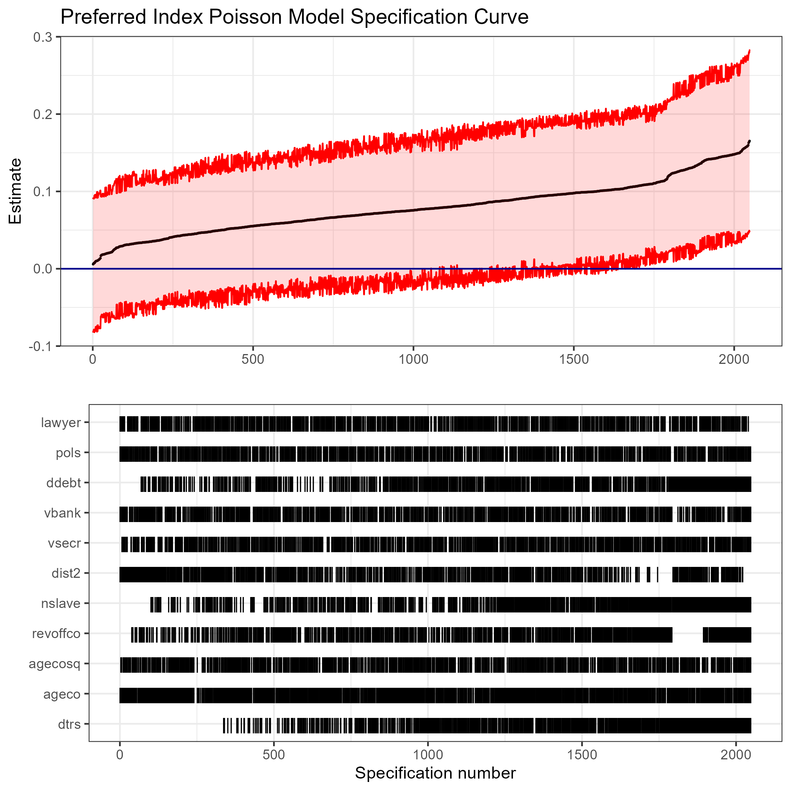

```{r, include=FALSE}
library(tidyverse)
library(broom)
library(cowplot)
library(fixest)
library(gridExtra)
library(kableExtra)
```
Full replication at: https://github.com/zaynesember/PopeSchmidtReplication

The specification curves presented here come from Jeremy C. Pope and Soren J. Schmidt's 2021 piece "Father Founders: Did Child Gender Affect Voting at the Constitutional Convention?". In it, they test the hypothesis that the delegates with sons would tend to vote for a stronger national government because they foresaw such a government providing greater opportunities for their sons--for which they find evidence. I present a specification curve analysis for two of their models which both contain a variety of controls: their primary Poisson regression model which uses a "preferred index" that tallies votes in favor of expansion of the national government as the dependent variable and a probit model using a single vote on whether to allow those in debt to the national government to serve as legislators.

```{r, eval=FALSE, include=FALSE}
# CODE FROM GARETH NELLIS
# declare controls      
  controls <- 
    c("dtrs", "ageco", "agecosq", 
      "revoffco", "nslave", "dist2", 
      "vsecr", "vbank", "ddebt", "pols", 
      "lawyer")

# all unique control combinations (i.e. powerset, including the empty set)
  # adapted from https://stackoverflow.com/questions/49570793/r-list-all-combinations-with-combn-multiple-m-values
  control_list <- 
    data.frame(
      x = "sons",
      controls = 
        list(do.call("c", lapply(seq_along(controls), function(i) utils::combn(controls, i, FUN = list))) %>%
        map(function(x) paste(x, collapse = " + ")), "") %>%
        unlist())

# estimation function
  spec_curve_ests <-
    function(
      x = NULL,
      controls = NULL) {

    if(controls == "") {plus <- ""} else {plus <- "+"}    
    
        frm <- 
          as.formula(paste0("index1 ~", x, plus, controls))

        out <- 
          #feols(frm, cluster = ~svy_sh_tsp_code, data = analysis_df) %>% 
          glm(frm, data=dataset, family = poisson(link = "log")) %>% 
          tidy(conf.int = T) %>% 
          mutate(control_set = as.character(controls))
        
      }  

# run models  
  res <- 
    pmap_dfr(control_list, .f = spec_curve_ests) %>% 
    filter(term == "sons") %>% 
    arrange(estimate) %>%
    mutate(specifications = 1:nrow(.))    
  
# plot top panel  
  p1 <-   
    res %>%
    ggplot(aes(x = specifications, y = estimate)) +
      #geom_pointrange(size=0.25) +
      geom_point(size=0.1) +
      geom_ribbon(aes(ymin = conf.low, ymax = conf.high), fill="red", col="red", alpha=0.15) +
      labs(x = "", y = "Estimate") +
      geom_hline(yintercept = 0, color = "darkblue") +
      ggtitle("Preferred Index Poisson Model Specification Curve") +
      theme_bw()  

# lower plot  
  p2 <- 
    expand.grid(control = controls, specifications = c(1:max(res$specifications))) %>% 
    left_join(res, by = "specifications") %>% 
    mutate(value = ifelse(str_detect(control_set, as.character(control)), "|", "")) %>%  
    ggplot(aes(specifications, control)) +   
      geom_text(aes(label = value)) +
      scale_color_manual(values = c("lightblue")) +
      labs(x = "Specification number", y = "") + 
      theme_bw()  
  
# stack them
  # spec_curve2 <- plot_grid(
  #   p1, p2, 
  #   labels = c("A", "B"), 
  #   align = "v", 
  #   axis = "rbl", 
  #   rel_heights = c(2, 3), 
  #   ncol = 1)  

ggsave(file="speccurve1.png", arrangeGrob(p1, p2, nrow=2))
```

```{r, out.width="70%", out.height="70%", fig.show='hold', fig.align='center', echo=FALSE}

```

```{r, eval=FALSE, include=FALSE}
# CODE FROM GARETH NELLIS
# declare controls      
  controls <- 
    c("dtrs", "ageco", "agecosq", 
      "revoffco", "nslave", "dist2", 
      "vsecr", "vbank", "ddebt", "pols", 
      "lawyer")

# all unique control combinations (i.e. powerset, including the empty set)
  # adapted from https://stackoverflow.com/questions/49570793/r-list-all-combinations-with-combn-multiple-m-values
  control_list <- 
    data.frame(
      x = "sons",
      controls = 
        list(do.call("c", lapply(seq_along(controls), function(i) utils::combn(controls, i, FUN = list))) %>%
        map(function(x) paste(x, collapse = " + ")), "") %>%
        unlist())

# estimation function
  spec_curve_ests <-
    function(
      x = NULL,
      controls = NULL) {

    if(controls == "") {plus <- ""} else {plus <- "+"}    
    
        frm <- 
          as.formula(paste0("anti5 ~", x, plus, controls))

        out <- 
          #feols(frm, cluster = ~svy_sh_tsp_code, data = analysis_df) %>% 
          glm(frm, data=dataset, family=binomial(link="probit")) %>% 
          tidy(conf.int = T) %>% 
          mutate(control_set = as.character(controls))
        
      }  

# run models  
  res <- 
    pmap_dfr(control_list, .f = spec_curve_ests) %>% 
    filter(term == "sons") %>% 
    arrange(estimate) %>%
    mutate(specifications = 1:nrow(.))    
  
# plot top panel  
  p1 <-   
    res %>%
    ggplot(aes(x = specifications, y = estimate)) +
      #geom_pointrange(size=0.25) +
      geom_point(size=0.1) +
      geom_ribbon(aes(ymin = conf.low, ymax = conf.high), fill="red", col="red", alpha=0.15) +
      labs(x = "", y = "Estimate") +
      geom_hline(yintercept = 0, color = "darkblue") +
      ggtitle("Debtor Legislators Probit Model Specification Curve") +
      theme_bw()  

# lower plot  
  p2 <- 
    expand.grid(control = controls, specifications = c(1:max(res$specifications))) %>% 
    left_join(res, by = "specifications") %>% 
    mutate(value = ifelse(str_detect(control_set, as.character(control)), "|", "")) %>%  
    ggplot(aes(specifications, control)) +   
      geom_text(aes(label = value)) +
      scale_color_manual(values = c("lightblue")) +
      labs(x = "Specification number", y = "") + 
      theme_bw()  
  
# stack them
  # plot_grid(
  #   p1, p2, 
  #   labels = c("A", "B"), 
  #   align = "v", 
  #   axis = "rbl", 
  #   rel_heights = c(2, 3), 
  #   ncol = 1)  
  
ggsave(file="speccurve2.png", arrangeGrob(p1, p2, nrow=2))
```
```{r, out.width="70%", out.height="70%", fig.show='hold', fig.align='center', echo=FALSE}
knitr::include_graphics("speccurve20.png")
```

Both models appear sensitive to which controls are included, showing a significant result for the number sons only when most of the controls are included. 

```{r, fig.show='hold', echo=FALSE}
var_names <- c('index1',
                'vote2',
                'anti5',
                'anti6',
                'anti7',
                'vote8',
                'vote9',
                'anti14',
                'vote15',
                'sons',
                'dtrs',
                'ageco',
                'agecosq',
                'revoffco',
                'nslave',
                'dist2',
                'vsecr',
                'vbank',
                'ddebt',
                'pols',
                'lawyer')

full_names <- c("Preferred Index",
                "National Veto",
                "Debtor Legislators",
                "Cong. Quorum.",
                "National Exports",
                "Militia Control",
                "State Credit",
                "Navigation Acts",
                "Military Responsibility",
                "Number of sons",
                "Number of daughters",
                "Age",
                "Age squared",
                "Revolutionary war officer",
                "Logged number of slaves",
                "Distance to navigable coastline",
                "Public securities (1000s, 1787 dollars)",
                "Private securities (1000s, 1787 dollars)",
                "Debtor (dummy)",
                "Politician",
                "Lawyer")                

kable(cbind(var_names, full_names), col.names=c("Variable name","Full name"),
      caption="Variable Key", booktabs=T) %>%
  kable_styling(latex_options = "hold_position")
      
```